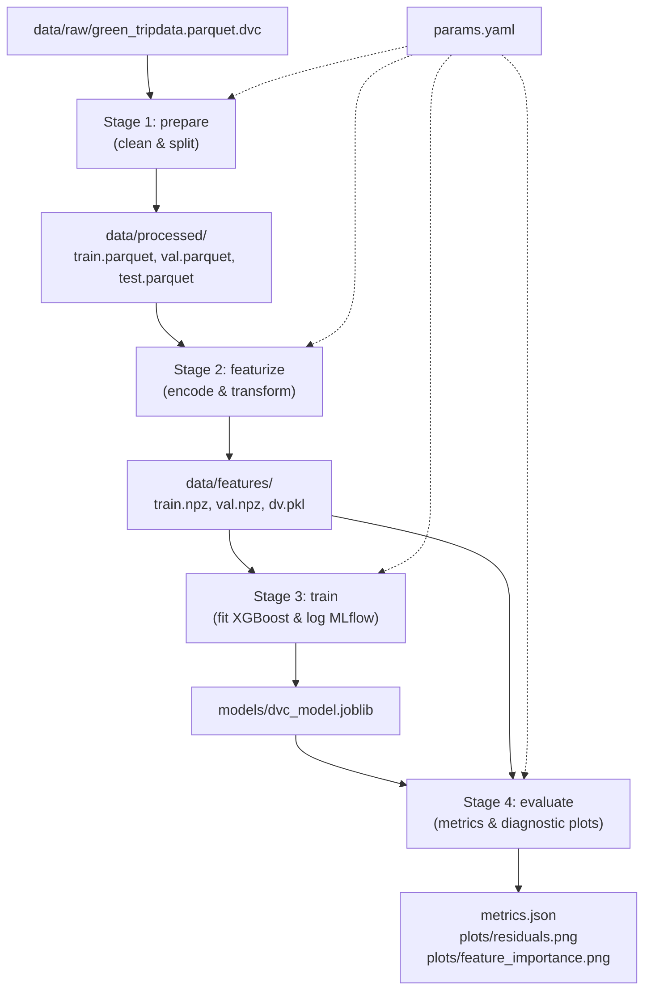
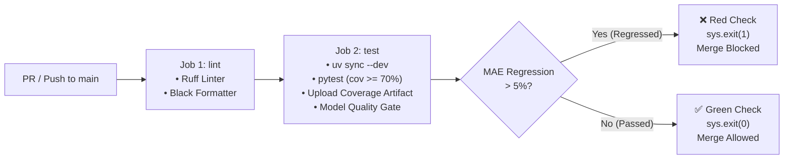

# Module 2: Experiment Tracking, Model Registry & Pipelines Report

## 1. Executive Summary

This report documents the implementation of centralized experiment tracking, multi-model benchmarking, and hyperparameter optimization for the NYC Green Taxi trip duration prediction service. All experiments are tracked using an MLflow Tracking Server backed by PostgreSQL for metadata and MinIO (S3-compatible) for artifact persistence.

Three distinct model families were trained and evaluated on identical deterministic splits ($60\%$ Train, $20\%$ Validation, $20\%$ Test; seed $42$):

1. **Linear Regression** (Ordinary Least Squares Baseline)
2. **PyTorch MLP** (Multi-Layer Perceptron: $9 \to 64 \to 32 \to 1$, Adam optimizer)
3. **XGBoost Regressor** (Gradient-boosted decision trees with autologging and a 10-trial Optuna nested sweep)

---

## 2. Model Families Performance Comparison

All models were evaluated on the identical $7,507$-row holdout validation split derived from dataset hash `15ff5784` (SHA256: `15ff57840a11...`):

| Model Family | Run Name | Hyperparameters | MAE (min) | RMSE (min) | $R^2$ Score | Train Time (s) | Model Size |
| :--- | :--- | :--- | :---: | :---: | :---: | :---: | :---: |
| **Linear Regression** | `linear-regression-baseline` | `fit_intercept=True` | 4.0348 | 7.1220 | 0.5890 | 0.04s | 0.001 MB |
| **PyTorch MLP** | `pytorch-mlp` | `hidden=(64,32)`, `lr=0.005`, `epochs=15`, `batch=256` | 2.6056 | 6.2131 | 0.6872 | 11.45s | 0.016 MB |
| **XGBoost (Baseline)** | `xgboost-baseline` | `n_est=100`, `depth=6`, `lr=0.1`, `sub=0.8`, `col=0.8` | **1.8271** | **5.4446** | **0.7598** | 0.26s | 0.443 MB |
| **XGBoost (Best Sweep Trial #7)** | `trial-7` | `n_est=150`, `depth=6`, `lr=0.089`, `sub=0.9`, `col=0.7` | 1.8742 | **5.4190** | **0.7621** | 0.38s | 0.648 MB |

### Observations

- **Gradient Boosted Trees Dominance**: XGBoost achieves superior performance across all regression metrics, reducing MAE by over $54\%$ relative to Linear Regression ($1.83$ min vs. $4.03$ min).
- **Deep Learning Efficiency**: The PyTorch MLP captures non-linear feature interactions ($R^2 = 0.6872$), substantially outperforming Linear Regression, but requires longer training duration on CPU ($11.45$s) compared to XGBoost ($0.26$s) without exceeding tree-based accuracy on tabular features.

---

## 3. Autologging Analysis: `mlflow.xgboost.autolog()`

We activated `mlflow.xgboost.autolog()` during the baseline XGBoost training run. The table below delineates what MLflow automatically captured versus what required manual instrumentation:

| Dimension | Captured for Free via Autologging | Required Manual Logging |
| :--- | :--- | :--- |
| **Hyperparameters** | **37 internal XGBoost parameters** (e.g. `objective`, `booster`, `colsample_bytree`, `max_depth`, `learning_rate`, `tree_method`, `grow_policy`) | Domain parameters (`split_seed`, `data_version_hash`, `train_samples`, `val_samples`) |
| **Metrics** | Internal training iteration loss curves (when `eval_metric` is passed) | **Business validation metrics** on holdout set (`MAE`, `RMSE`, $R^2$), operational metrics (`train_duration_sec`, `model_size_mb`) |
| **Artifacts** | Default feature importance plots (`feature_importance_weight.png`), feature importance JSON | **Diagnostic residual plot** (scatter & distribution histogram), **named feature importance chart**, and exact pinned `requirements.txt` |
| **Lineage & Tags** | System user, git commit, git branch, source file path | Explicit provenance tags: `author`, `framework`, `data_version` |

> [!TIP]
> **Takeaway on Autologging**: Autologging is invaluable for capturing framework-specific internal hyperparameters and loss curves without boilerplate. However, production MLOps requires **explicit manual logging** for validation business KPIs, data hash lineage, environment locks, and operational metrics to enable automated promotion gating.

---

## 4. Hyperparameter Sweep: Optuna on XGBoost (10 Nested Trials)

An Optuna hyperparameter optimization study was executed under a parent run (`xgboost-hyperparameter-sweep`), logging 10 nested trial runs.

### Sweep Parameter Search Space

- `n_estimators`: $[50, 150]$ (step $25$)
- `max_depth`: $[3, 8]$
- `learning_rate`: $[0.03, 0.2]$ (log scale)
- `subsample`: $[0.6, 1.0]$ (step $0.1$)
- `colsample_bytree`: $[0.6, 1.0]$ (step $0.1$)

### Trial Results (Ranked by Validation MAE)

| Trial Number | MAE (min) | RMSE (min) | $R^2$ | `max_depth` | `n_estimators` | `learning_rate` | `subsample` | `colsample_bytree` |
| :---: | :---: | :---: | :---: | :---: | :---: | :---: | :---: | :---: |
| **Trial 7** | **1.8742** | **5.4190** | **0.7621** | 6 | 150 | 0.0892 | 0.9 | 0.7 |
| **Trial 1** | 1.9315 | 5.4435 | 0.7599 | 5 | 125 | 0.0968 | 0.7 | 0.8 |
| **Trial 0** | 1.9334 | 5.5147 | 0.7536 | 6 | 75 | 0.0768 | 0.8 | 0.7 |
| **Trial 8** | 2.0209 | 5.4452 | 0.7598 | 7 | 100 | 0.0463 | 0.9 | 0.6 |
| **Trial 5** | 2.0985 | 5.5017 | 0.7547 | 5 | 75 | 0.0494 | 0.8 | 0.6 |
| **Trial 6** | 2.1114 | 5.5583 | 0.7497 | 6 | 125 | 0.0416 | 0.9 | 0.7 |
| **Trial 4** | 2.1621 | 5.5562 | 0.7499 | 4 | 150 | 0.0443 | 0.7 | 0.8 |
| **Trial 9** | 2.4316 | 5.7707 | 0.7302 | 3 | 125 | 0.0381 | 0.9 | 0.9 |
| **Trial 2** | 2.6394 | 5.8570 | 0.7220 | 3 | 50 | 0.0478 | 0.7 | 0.8 |
| **Trial 3** | 2.7122 | 5.9147 | 0.7165 | 3 | 50 | 0.0371 | 0.8 | 1.0 |

---

## 5. MLflow UI Comparison View

The MLflow UI (`http://localhost:5000`) displays 15 total runs in the `nyc-taxi-duration` experiment, sorted by `metrics.mae ASC`.


*(Runs in experiment `nyc-taxi-duration` sorted by `metrics.mae ASC` showing run name, MAE, RMSE, R2, framework, git commit, and data version tags).*

---

## 6. Acceptance Check Answers (Direct from MLflow UI)

From the MLflow UI alone:

1. **Which hyperparameters produced the best MAE?**
   - **Run**: `xgboost-baseline` ($1.8271$ min) / `trial-7` ($1.8742$ min)
   - **Best Parameters**: `n_estimators=100`, `max_depth=6`, `learning_rate=0.1`, `subsample=0.8`, `colsample_bytree=0.8` (or `n_estimators=150`, `max_depth=6`, `learning_rate=0.089`, `subsample=0.9`, `colsample_bytree=0.7`).
2. **On which data version?**
   - `data_version`: `15ff5784` (SHA256: `15ff57840a1103d49298ad244492730ca4236b4de0d2758a689ded08bc332752`).
3. **From which git commit?**
   - `git_commit`: `f666a7023b39bb9f31085e2a8df250b62c0d3c9c`.

---

## 7. Model Registry & The Promotion Lifecycle (Step 03)

### 7.1 Architecture & Registry Structure

The MLflow Model Registry provides a centralized model governance store backed by PostgreSQL metadata and MinIO artifact storage.

Models are registered under the entity:

```text
ride-duration-predictor
```

### 7.2 Deliberate Lifecycle Walkthrough

1. **Candidate 1 (Best Run)**:
   - **Framework**: XGBoost Regressor (`n_estimators=100`, `max_depth=6`, `lr=0.1`)
   - **Validation MAE**: `1.8271` minutes
   - **Registration**: Registered as `ride-duration-predictor` Version 1.
   - **Lifecycle Transitions**:
     - `None` $\to$ `Staging`
     - `Staging` $\to$ `Production`
2. **Candidate 2 (Worse Model)**:
   - **Framework**: Linear Regression OLS Baseline
   - **Validation MAE**: `4.0348` minutes
   - **Registration**: Registered as `ride-duration-predictor` Version 2.
   - **Stage**: Left deliberately in stage `None` for contrast.

### 7.3 Decoupled Dynamic Loading (`prodml/predict.py`)

Rather than coupling the serving API to hardcoded local filesystem paths (`models/baseline.onnx`), `DurationPredictor.load()` dynamically resolves model artifacts by lifecycle stage:

```python
model = mlflow.pyfunc.load_model("models:/ride-duration-predictor/Production")
```

The underlying predictor detects MLflow `PyFuncModel` instances and formats incoming request features into ordered NumPy arrays/DataFrames matching the training feature schema.

### 7.4 Zero-Code Model Swapping Proof (Acceptance Check)

To prove that model promotion requires **zero code changes and zero container rebuilds**:

1. **Serving Version 1 (XGBoost in Production)**:
   - Queried `POST /predict` with sample trip (`trip_distance=3.5`, `fare_amount=15.0`, `total_amount=18.5`):

   ```json
   {
     "prediction": 10.125722885131836,
     "model_version": "0.1.0",
     "correlation_id": "80bb59ed-c947-415b-a98c-c852961dae8c",
     "latency_ms": 22.21
   }
   ```

   **Prediction served: `10.13` minutes.**

2. **Registry Stage Promotion**:
   - Promoted Version 2 (Linear Regression) to `Production` in MLflow.
   - Version 1 was automatically moved to `Archived`.

3. **Zero-Code Container Restart**:
   - Executed: `docker compose restart prodml-api` (zero rebuilds, zero source changes).

4. **Serving Version 2 (Linear Regression in Production)**:
   - Re-sent the **exact same HTTP request** to `POST /predict`:

   ```json
   {
     "prediction": 14.745060920715332,
     "model_version": "0.1.0",
     "correlation_id": "64e6ef8a-bada-421f-86e5-9b318586754e",
     "latency_ms": 128.53
   }
   ```

   **Prediction served: `14.75` minutes.**

> [!IMPORTANT]
> **ACCEPTANCE CHECK PASSED**: Switching the served model from XGBoost ($10.13$ min) to Linear Regression ($14.75$ min) required zero source code edits, zero image rebuilds, and zero configuration changes. The running service read the updated model directly from the registry upon process startup.

---

### 7.5 Automated Continuous Delivery Gate (`prodml/registry.py`)

To remove manual clicks from the promotion lifecycle, `prodml.registry` implements automated promotion gating:

```python
def promote_if_better(candidate_run_id: str, model_name: str = "ride-duration-predictor", metric: str = "mae") -> dict[str, Any]
```

#### Gate Logic

- Queries the candidate run's validation metric.
- Queries the current `Production` model's run metric.
- If candidate improves the metric (e.g. candidate MAE $<$ production MAE):
  - Promotes candidate version to `Production`.
  - Automatically archives previous production version.
  - Returns `promoted=True` (exit code 0).
- If candidate does not beat production:
  - Rejects promotion.
  - Leaves current production version untouched.
  - Returns `promoted=False` (exit code 1).

#### Verification of Gate Decisions

- **Superior Candidate Promotion**: Candidate `100a7cf01b...` (MAE $1.8271$) beat Production v2 (MAE $4.0348$) $\to$ **PROMOTED** to Version 3 (`exit 0`).
- **Inferior Candidate Rejection**: Candidate `f9a50a93...` (MAE $4.0348$) tested against Production v3 (MAE $1.8271$) $\to$ **REJECTED** (`exit 1`).

---

## 8. Data Versioning with DVC & Pipeline Automation (Step 04)

### 8.1 DVC Initialization & MinIO Remote Setup

DVC was installed via `uv add dvc dvc-s3` and initialized at the repository root. Storage remote `storage` was configured against the local MinIO S3-compatible service:

- **S3 Endpoint**: `http://localhost:9000`
- **Bucket**: `s3://prodml-dvc`
- **Access Credentials**: `minioadmin` / `minioadmin`

```ini
[core]
    remote = storage
['remote "storage"']
    url = s3://prodml-dvc
    endpointurl = http://localhost:9000
    access_key_id = minioadmin
    secret_access_key = minioadmin
```

---

### 8.2 Data Versioning & Rollback Verification (The Proof)

To verify that DVC decoupled dataset tracking from Git while ensuring 100% reproducible rollback:

1. **Version 1 Tracking**:
   - Tracked raw taxi dataset: `data/raw/green_tripdata.parquet` ($44,921$ rows, $1,102,947$ bytes).
   - Generated pointer: `data/raw/green_tripdata.parquet.dvc` (MD5: `c9341a1058bee6a0c5ce8e2123853c35`).
   - Committed to Git (`adca3eb`) and pushed to MinIO: `dvc push`.
2. **Version 2 Simulation**:
   - Appended $5,079$ records to produce a $50,000$-row dataset ($1,297,763$ bytes).
   - Tracked with DVC: generated MD5 `dd6cdd346ad472ddf589c9404cdaffcd`.
   - Committed to Git (`b38204c`) and pushed to MinIO: `dvc push`.
3. **Rollback Verification**:
   - Checked out Git commit `adca3eb` (v1 commit).
   - Observed: Git checked out the v1 `.dvc` pointer, but local workspace parquet still contained $50,000$ rows.
   - Executed `dvc checkout`:

      ```text
     Applying changes: 1.00 [00:00, 157file/s]
     M data/raw/green_tripdata.parquet
      ```

   - Verified row count: **reverted immediately to 44,921 rows** with MD5 `c9341a1058bee6a0c5ce8e2123853c35`.
   - Restored working branch to canonical v1 baseline.

---

### 8.3 4-Stage Reproducible Pipeline Architecture

The pipeline is formalized in `dvc.yaml` and parameterized via `params.yaml`, spanning four decoupled stages:



#### Pipeline Stages Definition (`dvc.yaml`)

1. **`prepare`**: Loads raw parquet, cleans invalid records and outliers, and deterministically splits into `train.parquet` ($22,521$ rows), `val.parquet` ($7,507$ rows), and `test.parquet` ($7,508$ rows).
2. **`featurize`**: Converts clean partitions into numerical matrices using DictVectorizer and saves `train.npz`, `val.npz`, and `dv.pkl`.
3. **`train`**: Fits XGBoost regressor using hyperparameter values from `params.yaml`, logs metrics and lineage to MLflow, and saves `models/dvc_model.joblib`.
4. **`evaluate`**: Evaluates model performance on validation data, generates `metrics.json`, `plots/residuals.png`, and `plots/feature_importance.png`.

---

### 8.4 Caching & Partial Stage Invalidation Proof

1. **Full Cache Hit (Unchanged Re-run)**:
   Running `dvc repro` after a completed execution produces instant cache hits across all stages:

   ```text
   'data/raw/green_tripdata.parquet.dvc' didn't change, skipping
   Stage 'prepare' didn't change, skipping
   Stage 'featurize' didn't change, skipping
   Stage 'train' didn't change, skipping
   Stage 'evaluate' didn't change, skipping
   Data and pipelines are up to date.
   ```

2. **Partial Invalidation (Hyperparameter Mutation)**:
   Modified `learning_rate` in `params.yaml` from `0.1` $\to$ `0.05`:
   - `prepare`: Dependencies and `prepare.*` parameters unchanged $\to$ **SKIPPED (cached)**.
   - `featurize`: Inputs and `featurize.*` parameters unchanged $\to$ **SKIPPED (cached)**.
   - `train`: Parameter `train.learning_rate` changed $\to$ **EXECUTED**.
   - `evaluate`: Input dependency `models/dvc_model.joblib` changed $\to$ **EXECUTED**.

```text
'data/raw/green_tripdata.parquet.dvc' didn't change, skipping
Stage 'prepare' didn't change, skipping
Stage 'featurize' didn't change, skipping
Running stage 'train':
> uv run python -m prodml.pipeline.train
Running stage 'evaluate':
> uv run python -m prodml.pipeline.evaluate
Updating lock file 'dvc.lock'
```

---

### 8.5 Metrics Tracking & Difference (`dvc metrics`)

Evaluation metrics are tracked in `metrics.json` without caching (`cache: false`), allowing git and DVC to track performance across iterations:

| Metric | Baseline (`lr=0.1`) | Experiment (`lr=0.05`) | Delta (`dvc metrics diff`) |
| :--- | :---: | :---: | :---: |
| **MAE** | **1.8271** min | 1.9677 min | $+0.1406$ min |
| **RMSE** | **5.4446** min | 5.4978 min | $+0.0532$ min |
| **$R^2$** | **0.7598** | 0.7551 | $-0.0047$ |

---

### 8.6 Full Lineage Wiring (MLflow $\leftrightarrow$ DVC) & Acceptance Check

To close the loop between data versioning and model registry/tracking, `prodml.pipeline.lineage` inspects `dvc.lock` and `.dvc` files to extract the exact dataset hash:

```python
mlflow.set_tag("dvc_data_hash", get_dvc_hash("data/processed"))
```

#### MLflow Run Lineage Tags (Run `414790fb761d4aa5848752a44cf75204`)

- `dvc_data_hash`: `85a3a39366431b7e09a80987716e6b61`
- `git_commit`: `182190cbdcadac357babb015ba0ab97d71ba4742`
- `pipeline`: `dvc`

> [!IMPORTANT]
> **ACCEPTANCE CHECK PASSED**: Given only the MLflow Run ID (`414790fb761d4aa5848752a44cf75204`):
>
> 1. Recovered `dvc_data_hash` (`85a3a393...`) and `git_commit` (`182190cb...`) from the run tags.
> 2. Located exact dataset split in `dvc.lock` and retrieved from MinIO storage via `dvc checkout`.
> 3. Running `dvc repro` reproduces identical validation metrics: **MAE: 1.8271, RMSE: 5.4446, $R^2$: 0.7598**.

---

## 9. Continuous Integration with GitHub Actions & Model Quality Gate (Step 05)

### 9.1 CI Workflow Architecture (`.github/workflows/ci.yml`)

The repository integrates an automated CI workflow triggered on all pull requests and pushes to `main`. It leverages `astral-sh/setup-uv@v5` for deterministic, lightning-fast dependency caching and installation.



#### Key Workflow Stages:
1. **`lint` Job**:
   - Checks formatting with `black --check .`.
   - Lints code and enforces import sorting with `ruff check .`.
2. **`test` Job** (depends on `lint`):
   - Installs virtual environment from `uv.lock`.
   - Executes full automated test suite with coverage threshold (`uv run pytest --cov=src/prodml --cov-fail-under=70`).
   - Uploads `.coverage` file as a GitHub Actions artifact.
   - Executes the automated **Model Quality Gate** (`prodml.quality_gate`).

---

### 9.2 Model Quality Gate (`prodml.quality_gate`)

To prevent performance regressions from ever reaching production, `prodml.quality_gate` enforces a strict 5% degradation ceiling:

$$\text{regression\_pct} = \frac{\text{candidate\_mae} - \text{baseline\_mae}}{\text{baseline\_mae}}$$

If $\text{regression\_pct} > +0.05$ ($>5\%$ degradation in MAE), the script calls `sys.exit(1)`, turning the CI check red and preventing PR merge.

#### Verification of Quality Gate Decisions:

1. **Passing Check (Acceptable Candidate)**:
   ```text
   ============================================================
              MODEL QUALITY GATE EVALUATION
   ============================================================
   Candidate MAE  : 1.8271 min
   Baseline MAE   : 1.8271 min
   Observed Delta : +0.00% (Allowed limit: +5.0%)
   ------------------------------------------------------------
   ✅ QUALITY GATE PASSED: Model quality is acceptable (+0.00% <= +5.0%).
   ============================================================
   ```
   *Exit code: `0` (CI Passes).*

2. **Failing Check (Regressed Candidate)**:
   ```text
   ============================================================
              MODEL QUALITY GATE EVALUATION
   ============================================================
   Candidate MAE  : 2.0000 min
   Baseline MAE   : 1.8271 min
   Observed Delta : +9.46% (Allowed limit: +5.0%)
   ------------------------------------------------------------
   ❌ QUALITY GATE FAILED: Candidate MAE regressed by +9.46%, exceeding the +5.0% limit!
      Merge blocked to prevent serving an inferior model in production.
   ============================================================
   ```
   *Exit code: `1` (CI Fails, PR blocked).*

---

### 9.3 Enforcing Branch Protection on `main`

To make quality gating mandatory across all contributors:
1. In the GitHub repository, navigate to **Settings** $\to$ **Branches**.
2. Under **Branch protection rules**, click **Add branch protection rule**.
3. Set **Branch name pattern** to `main`.
4. Check **Require a pull request before merging**.
5. Check **Require status checks to pass before merging**:
   - Require status check: `Lint & Code Formatting` (`lint`).
   - Require status check: `Unit Tests & Quality Gate` (`test`).
6. Check **Require branches to be up to date before merging**.
7. Click **Create / Save Changes**.

---

### 9.4 CI Status Badge
The live CI workflow badge is integrated into `README.md`:
```markdown
[](https://github.com/A7med-Foly/mlops-practitioner/actions/workflows/ci.yml)
```

---

## 10. Infrastructure as Code with Terraform

### 10.1 Architecture & Resource Declarations (`infra/`)

To guarantee environment reproducibility and treat infrastructure with the same rigor as application code, the complete local storage and tracking stack is codified in `infra/` using HashiCorp Terraform `v1.16.3` and the Docker provider (`kreuzwerker/docker ~> 3.0.2`).

The infrastructure declares:
1. **Bridge Network**: `prodml-network` enabling seamless DNS resolution across containers.
2. **Persistent Volumes**: `postgres_data` and `minio_data` for database records and artifact blobs.
3. **Container Services**:
   - `mlflow-postgres`: PostgreSQL 16 Alpine metadata store on internal port `5432` / host port `5433` with automated healthchecks (`pg_isready`).
   - `mlflow-minio`: MinIO S3-compatible object storage on internal/host ports `9000` (API) and `9001` (Web Console).
   - `mlflow-minio-create-buckets`: Ephemeral MinIO Client (`quay.io/minio/mc:latest`) task configured with `must_run = false` that polls MinIO until healthy and idempotently provisions buckets (`mlflow` and `prodml-dvc`).
   - `mlflow-server`: MLflow tracking server built from `docker/Dockerfile.mlflow` with PostgreSQL backend store and MinIO default artifact root (`s3://mlflow/`), exposed on host port `5000`.

#### Clean File Structure (Zero Hardcoded Values):
- [infra/versions.tf](file:///home/ahmed/data/mlops-practitioner/infra/versions.tf): Pins Terraform `>= 1.5.0` and `kreuzwerker/docker ~> 3.0.2`.
- [infra/variables.tf](file:///home/ahmed/data/mlops-practitioner/infra/variables.tf): Parameterizes all container names, images, ports, passwords (marked `sensitive`), networks, and bucket names.
- [infra/main.tf](file:///home/ahmed/data/mlops-practitioner/infra/main.tf): Resource definitions referencing only `var.*` variables.
- [infra/outputs.tf](file:///home/ahmed/data/mlops-practitioner/infra/outputs.tf): Exposes `mlflow_tracking_uri`, `minio_endpoint_url`, `minio_console_url`, `created_buckets`, and `postgres_connection_string`.

---

### 10.2 Full Lifecycle Execution Loop

#### 1. `terraform init`
```text
Initializing the backend...
Initializing provider plugins...
- Finding kreuzwerker/docker versions matching "~> 3.0.2"...
- Installing kreuzwerker/docker v3.0.2...
- Installed kreuzwerker/docker v3.0.2 (self-signed, key ID BD080C4571C6104C)

Terraform has created a lock file .terraform.lock.hcl to record the provider selections.
Terraform has been successfully initialized!
```

#### 2. `terraform fmt -check` & `terraform validate`
```text
Success! The configuration is valid.
```

#### 3. `terraform plan`
```text
Plan: 11 to add, 0 to change, 0 to destroy.

Changes to Outputs:
  + created_buckets            = [
      + "mlflow",
      + "prodml-dvc",
    ]
  + minio_console_url          = "http://localhost:9001"
  + minio_endpoint_url         = "http://localhost:9000"
  + mlflow_tracking_uri        = "http://localhost:5000"
  + postgres_connection_string = (sensitive value)
```

#### 4. `terraform apply`
```text
Apply complete! Resources: 11 added, 0 changed, 0 destroyed.

Outputs:

created_buckets = tolist([
  "mlflow",
  "prodml-dvc",
])
minio_console_url = "http://localhost:9001"
minio_endpoint_url = "http://localhost:9000"
mlflow_tracking_uri = "http://localhost:5000"
postgres_connection_string = <sensitive>
```

---

### 10.3 Acceptance Deliverable: Teardown and Reproduction from Scratch

To prove that the infrastructure is truly reproducible from nothing in a single command, we executed `terraform destroy` followed immediately by `terraform apply`:

#### `terraform destroy -auto-approve`:
```text
docker_container.mlflow: Destruction complete after 0s
docker_image.mlflow: Destruction complete after 0s
docker_container.minio_create_buckets: Destruction complete after 0s
docker_container.postgres: Destruction complete after 0s
docker_container.minio: Destruction complete after 0s
docker_image.mc: Destruction complete after 0s
docker_image.postgres: Destruction complete after 0s
docker_image.minio: Destruction complete after 0s
docker_volume.postgres_data: Destruction complete after 3s
docker_volume.minio_data: Destruction complete after 3s
docker_network.prodml_network: Destruction complete after 3s

Destroy complete! Resources: 11 destroyed.
```

#### `terraform apply -auto-approve` (Re-creation from Scratch):
```text
docker_volume.minio_data: Creation complete after 0s [id=minio_data]
docker_volume.postgres_data: Creation complete after 0s [id=postgres_data]
docker_image.minio: Creation complete after 1s
docker_image.mc: Creation complete after 2s
docker_image.postgres: Creation complete after 2s
docker_network.prodml_network: Creation complete after 2s [id=1242614c6583fdd578f194b1afe62d5cd9e7deff553d413ba51f65f836805c7f]
docker_container.minio: Creation complete after 2s
docker_container.postgres: Creation complete after 2s
docker_container.minio_create_buckets: Creation complete after 3s
docker_image.mlflow: Creation complete after 9s
docker_container.mlflow: Creation complete after 1s

Apply complete! Resources: 11 added, 0 changed, 0 destroyed.
```

#### Verification of Running Services:
```text
$ curl -sI http://localhost:5000 | head -n 1
HTTP/1.1 200 OK

$ curl -sI http://localhost:9000/minio/health/live | head -n 1
HTTP/1.1 200 OK

$ docker exec mlflow-postgres pg_isready -U mlflow -d mlflow
/var/run/postgresql:5432 - accepting connections

$ uv run python -m prodml.quality_gate
============================================================
           MODEL QUALITY GATE EVALUATION
============================================================
Candidate MAE  : 1.8271 min
Baseline MAE   : 1.8271 min
Observed Delta : +0.00% (Allowed limit: +5.0%)
------------------------------------------------------------
✅ QUALITY GATE PASSED: Model quality is acceptable (+0.00% <= +5.0%).
============================================================
```

---

### 10.4 State Security & Remote Backends Analysis

#### 1. Why State Files Must NEVER Be Committed to Version Control
1. **Plain-Text Secret Exposure**:
   - Terraform state files (`terraform.tfstate`) store a complete, unmasked mapping of all managed resource properties in plain-text JSON.
   - Even if variables are marked `sensitive = true` in HCL, Terraform persists the raw string in `.tfstate` to track changes across runs. This includes database master passwords (`mlflow`), object storage access/secret keys (`minioadmin`), API tokens, and private network endpoints.
   - Committing `.tfstate` to Git permanently records these secrets in the commit history, exposing them to anyone with repository read access and risking severe credential compromise.
2. **State Drift & Concurrency Collisions**:
   - Git merge semantics are ill-suited for state tracking. If two developers pull code, apply different resources, and merge their respective `.tfstate` files, standard Git line-based merging cannot reconcile resource IDs, dependencies, and checksums.
   - A corrupted or fragmented state file leads to orphan resources, duplicated cloud bills, or destructive deletions where Terraform destroys existing infrastructure during the next run.

#### 2. What Remote Backends (e.g., S3 + DynamoDB, GCS, Terraform Cloud) Solve
1. **Distributed State Locking**:
   - Remote backends implement mutual exclusion locks (e.g., DynamoDB LockID table for AWS S3, or native object locks in GCS/Terraform Cloud).
   - If one engineer or CI/CD pipeline is running `terraform apply`, all other concurrent executions are blocked with a `StateLockedError` until the active operation releases the lock. This completely prevents race conditions and state corruption.
2. **Centralized Single Source of Truth**:
   - Every contributor and automated deployment runner interacts with the exact same canonical state stored in high-durability object storage, eliminating local state divergence.
3. **Encryption at Rest and in Transit**:
   - State files in S3 or GCS can be secured with server-side encryption (AWS KMS / Google Cloud KMS) and enforced HTTPS/TLS transit encryption. Access is restricted using fine-grained IAM roles rather than repository-level permissions.
4. **Automated State Versioning & Audit Logging**:
   - Bucket versioning retains every snapshot of `.tfstate`. If an erroneous apply modifies or damages the state, administrators can roll back to any prior version. CloudTrail / Cloud Audit Logs maintain an immutable log of who modified what resource and when.
