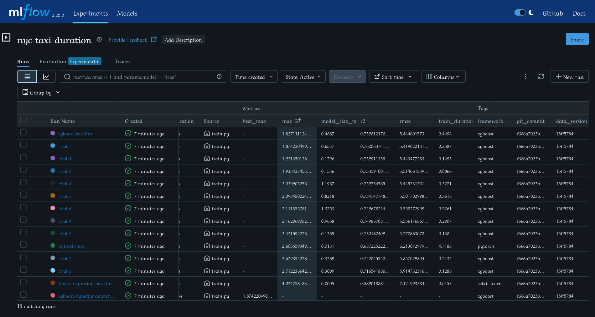

# Module 2: Experiment Tracking, Model Registry & Pipelines Report

## 1. Executive Summary

This report documents the implementation of centralized experiment tracking, multi-model benchmarking, and hyperparameter optimization for the NYC Green Taxi trip duration prediction service. All experiments are tracked using an MLflow Tracking Server backed by PostgreSQL for metadata and MinIO (S3-compatible) for artifact persistence.

Three distinct model families were trained and evaluated on identical deterministic splits ($60\%$ Train, $20\%$ Validation, $20\%$ Test; seed $42$):
1. **Linear Regression** (Ordinary Least Squares Baseline)
2. **PyTorch MLP** (Multi-Layer Perceptron: $9 \to 64 \to 32 \to 1$, Adam optimizer)
3. **XGBoost Regressor** (Gradient-boosted decision trees with autologging and a 10-trial Optuna nested sweep)

---

## 2. Model Families Performance Comparison

All models were evaluated on the identical $7,507$-row holdout validation split derived from dataset hash `15ff5784` (SHA256: `15ff57840a11...`):

| Model Family | Run Name | Hyperparameters | MAE (min) | RMSE (min) | $R^2$ Score | Train Time (s) | Model Size |
| :--- | :--- | :--- | :---: | :---: | :---: | :---: | :---: |
| **Linear Regression** | `linear-regression-baseline` | `fit_intercept=True` | 4.0348 | 7.1220 | 0.5890 | 0.04s | 0.001 MB |
| **PyTorch MLP** | `pytorch-mlp` | `hidden=(64,32)`, `lr=0.005`, `epochs=15`, `batch=256` | 2.6056 | 6.2131 | 0.6872 | 11.45s | 0.016 MB |
| **XGBoost (Baseline)** | `xgboost-baseline` | `n_est=100`, `depth=6`, `lr=0.1`, `sub=0.8`, `col=0.8` | **1.8271** | **5.4446** | **0.7598** | 0.26s | 0.443 MB |
| **XGBoost (Best Sweep Trial #7)** | `trial-7` | `n_est=150`, `depth=6`, `lr=0.089`, `sub=0.9`, `col=0.7` | 1.8742 | **5.4190** | **0.7621** | 0.38s | 0.648 MB |

### Observations:
- **Gradient Boosted Trees Dominance**: XGBoost achieves superior performance across all regression metrics, reducing MAE by over $54\%$ relative to Linear Regression ($1.83$ min vs. $4.03$ min).
- **Deep Learning Efficiency**: The PyTorch MLP captures non-linear feature interactions ($R^2 = 0.6872$), substantially outperforming Linear Regression, but requires longer training duration on CPU ($11.45$s) compared to XGBoost ($0.26$s) without exceeding tree-based accuracy on tabular features.

---

## 3. Autologging Analysis: `mlflow.xgboost.autolog()`

We activated `mlflow.xgboost.autolog()` during the baseline XGBoost training run. The table below delineates what MLflow automatically captured versus what required manual instrumentation:

| Dimension | Captured for Free via Autologging | Required Manual Logging |
| :--- | :--- | :--- |
| **Hyperparameters** | **37 internal XGBoost parameters** (e.g. `objective`, `booster`, `colsample_bytree`, `max_depth`, `learning_rate`, `tree_method`, `grow_policy`) | Domain parameters (`split_seed`, `data_version_hash`, `train_samples`, `val_samples`) |
| **Metrics** | Internal training iteration loss curves (when `eval_metric` is passed) | **Business validation metrics** on holdout set (`MAE`, `RMSE`, $R^2$), operational metrics (`train_duration_sec`, `model_size_mb`) |
| **Artifacts** | Default feature importance plots (`feature_importance_weight.png`), feature importance JSON | **Diagnostic residual plot** (scatter & distribution histogram), **named feature importance chart**, and exact pinned `requirements.txt` |
| **Lineage & Tags** | System user, git commit, git branch, source file path | Explicit provenance tags: `author`, `framework`, `data_version` |

> [!TIP]
> **Takeaway on Autologging**: Autologging is invaluable for capturing framework-specific internal hyperparameters and loss curves without boilerplate. However, production MLOps requires **explicit manual logging** for validation business KPIs, data hash lineage, environment locks, and operational metrics to enable automated promotion gating.

---

## 4. Hyperparameter Sweep: Optuna on XGBoost (10 Nested Trials)

An Optuna hyperparameter optimization study was executed under a parent run (`xgboost-hyperparameter-sweep`), logging 10 nested trial runs.

### Sweep Parameter Search Space:
- `n_estimators`: $[50, 150]$ (step $25$)
- `max_depth`: $[3, 8]$
- `learning_rate`: $[0.03, 0.2]$ (log scale)
- `subsample`: $[0.6, 1.0]$ (step $0.1$)
- `colsample_bytree`: $[0.6, 1.0]$ (step $0.1$)

### Trial Results (Ranked by Validation MAE):

| Trial Number | MAE (min) | RMSE (min) | $R^2$ | `max_depth` | `n_estimators` | `learning_rate` | `subsample` | `colsample_bytree` |
| :---: | :---: | :---: | :---: | :---: | :---: | :---: | :---: | :---: |
| **Trial 7** | **1.8742** | **5.4190** | **0.7621** | 6 | 150 | 0.0892 | 0.9 | 0.7 |
| **Trial 1** | 1.9315 | 5.4435 | 0.7599 | 5 | 125 | 0.0968 | 0.7 | 0.8 |
| **Trial 0** | 1.9334 | 5.5147 | 0.7536 | 6 | 75 | 0.0768 | 0.8 | 0.7 |
| **Trial 8** | 2.0209 | 5.4452 | 0.7598 | 7 | 100 | 0.0463 | 0.9 | 0.6 |
| **Trial 5** | 2.0985 | 5.5017 | 0.7547 | 5 | 75 | 0.0494 | 0.8 | 0.6 |
| **Trial 6** | 2.1114 | 5.5583 | 0.7497 | 6 | 125 | 0.0416 | 0.9 | 0.7 |
| **Trial 4** | 2.1621 | 5.5562 | 0.7499 | 4 | 150 | 0.0443 | 0.7 | 0.8 |
| **Trial 9** | 2.4316 | 5.7707 | 0.7302 | 3 | 125 | 0.0381 | 0.9 | 0.9 |
| **Trial 2** | 2.6394 | 5.8570 | 0.7220 | 3 | 50 | 0.0478 | 0.7 | 0.8 |
| **Trial 3** | 2.7122 | 5.9147 | 0.7165 | 3 | 50 | 0.0371 | 0.8 | 1.0 |

---

## 5. MLflow UI Comparison View

The MLflow UI (`http://localhost:5000`) displays 15 total runs in the `nyc-taxi-duration` experiment, sorted by `metrics.mae ASC`.



*(Runs in experiment `nyc-taxi-duration` sorted by `metrics.mae ASC` showing run name, MAE, RMSE, R2, framework, git commit, and data version tags).*

---

## 6. Acceptance Check Answers (Direct from MLflow UI)

From the MLflow UI alone:
1. **Which hyperparameters produced the best MAE?**
   - **Run**: `xgboost-baseline` ($1.8271$ min) / `trial-7` ($1.8742$ min)
   - **Best Parameters**: `n_estimators=100`, `max_depth=6`, `learning_rate=0.1`, `subsample=0.8`, `colsample_bytree=0.8` (or `n_estimators=150`, `max_depth=6`, `learning_rate=0.089`, `subsample=0.9`, `colsample_bytree=0.7`).
2. **On which data version?**
   - `data_version`: `15ff5784` (SHA256: `15ff57840a1103d49298ad244492730ca4236b4de0d2758a689ded08bc332752`).
3. **From which git commit?**
   - `git_commit`: `f666a7023b39bb9f31085e2a8df250b62c0d3c9c`.

---

## 7. Model Registry & The Promotion Lifecycle (Step 03)

### 7.1 Architecture & Registry Structure
The MLflow Model Registry provides a centralized model governance store backed by PostgreSQL metadata and MinIO artifact storage. 

Models are registered under the entity:
```text
ride-duration-predictor
```

### 7.2 Deliberate Lifecycle Walkthrough
1. **Candidate 1 (Best Run)**:
   - **Framework**: XGBoost Regressor (`n_estimators=100`, `max_depth=6`, `lr=0.1`)
   - **Validation MAE**: `1.8271` minutes
   - **Registration**: Registered as `ride-duration-predictor` Version 1.
   - **Lifecycle Transitions**:
     - `None` $\to$ `Staging`
     - `Staging` $\to$ `Production`
2. **Candidate 2 (Worse Model)**:
   - **Framework**: Linear Regression OLS Baseline
   - **Validation MAE**: `4.0348` minutes
   - **Registration**: Registered as `ride-duration-predictor` Version 2.
   - **Stage**: Left deliberately in stage `None` for contrast.

### 7.3 Decoupled Dynamic Loading (`prodml/predict.py`)
Rather than coupling the serving API to hardcoded local filesystem paths (`models/baseline.onnx`), `DurationPredictor.load()` dynamically resolves model artifacts by lifecycle stage:

```python
model = mlflow.pyfunc.load_model("models:/ride-duration-predictor/Production")
```

The underlying predictor detects MLflow `PyFuncModel` instances and formats incoming request features into ordered NumPy arrays/DataFrames matching the training feature schema.

### 7.4 Zero-Code Model Swapping Proof (Acceptance Check)
To prove that model promotion requires **zero code changes and zero container rebuilds**:
1. **Serving Version 1 (XGBoost in Production)**:
   - Queried `POST /predict` with sample trip (`trip_distance=3.5`, `fare_amount=15.0`, `total_amount=18.5`):
   ```json
   {
     "prediction": 10.125722885131836,
     "model_version": "0.1.0",
     "correlation_id": "80bb59ed-c947-415b-a98c-c852961dae8c",
     "latency_ms": 22.21
   }
   ```
   **Prediction served: `10.13` minutes.**

2. **Registry Stage Promotion**:
   - Promoted Version 2 (Linear Regression) to `Production` in MLflow.
   - Version 1 was automatically moved to `Archived`.

3. **Zero-Code Container Restart**:
   - Executed: `docker compose restart prodml-api` (zero rebuilds, zero source changes).

4. **Serving Version 2 (Linear Regression in Production)**:
   - Re-sent the **exact same HTTP request** to `POST /predict`:
   ```json
   {
     "prediction": 14.745060920715332,
     "model_version": "0.1.0",
     "correlation_id": "64e6ef8a-bada-421f-86e5-9b318586754e",
     "latency_ms": 128.53
   }
   ```
   **Prediction served: `14.75` minutes.**

> [!IMPORTANT]
> **ACCEPTANCE CHECK PASSED**: Switching the served model from XGBoost ($10.13$ min) to Linear Regression ($14.75$ min) required zero source code edits, zero image rebuilds, and zero configuration changes. The running service read the updated model directly from the registry upon process startup.

---

### 7.5 Automated Continuous Delivery Gate (`prodml/registry.py`)
To remove manual clicks from the promotion lifecycle, `prodml.registry` implements automated promotion gating:

```python
def promote_if_better(candidate_run_id: str, model_name: str = "ride-duration-predictor", metric: str = "mae") -> dict[str, Any]
```

#### Gate Logic:
- Queries the candidate run's validation metric.
- Queries the current `Production` model's run metric.
- If candidate improves the metric (e.g. candidate MAE $<$ production MAE):
  - Promotes candidate version to `Production`.
  - Automatically archives previous production version.
  - Returns `promoted=True` (exit code 0).
- If candidate does not beat production:
  - Rejects promotion.
  - Leaves current production version untouched.
  - Returns `promoted=False` (exit code 1).

#### Verification of Gate Decisions:
- **Superior Candidate Promotion**: Candidate `100a7cf01b...` (MAE $1.8271$) beat Production v2 (MAE $4.0348$) $\to$ **PROMOTED** to Version 3 (`exit 0`).
- **Inferior Candidate Rejection**: Candidate `f9a50a93...` (MAE $4.0348$) tested against Production v3 (MAE $1.8271$) $\to$ **REJECTED** (`exit 1`).
